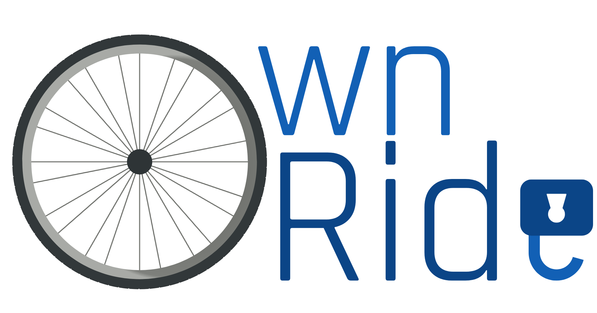
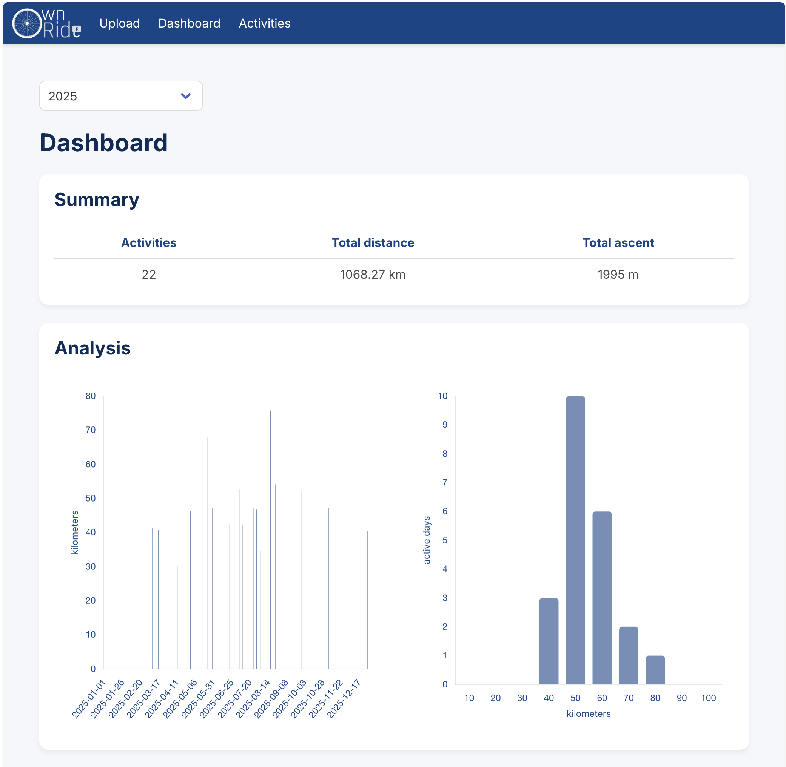
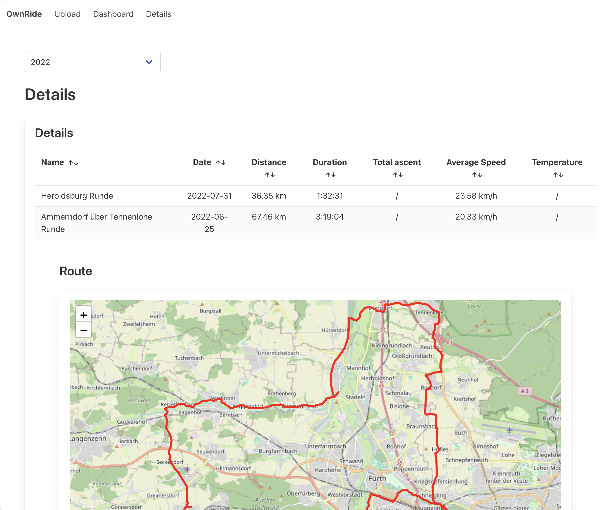
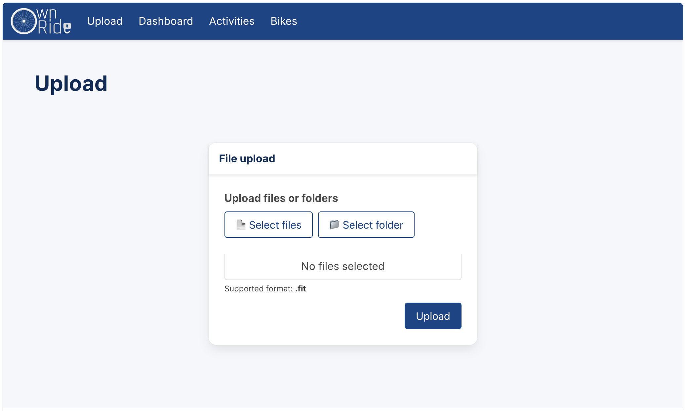

[](https://github.com/sw1ld/own-ride/actions/workflows/maven.yml) [](https://www.gnu.org/licenses/gpl-3.0)

When doing sports people track their activities to see how they improve over time.

I believe that your fitness data you create while tracking your activities should belong to you, and only you.
It should not matter how you track nor analyze it.
When cool applications grow bigger the focus usually switches from "serving customers needs" to "increasing cash flow".
The first thing that users will recognize is less free-to-use functionality.
To me personally, adding a premium version is fine in order to keep developing the product.
However, the red line gets crossed, when the focus shifts to "making it less attractive to switch to other applications" by e.g. disabling features such as "bulk export" of your own data.

At some point you feel like: "this application was once cool; now it sucks, but I am too deeply integrated".
With `OwnRide` I try to give a lightweight, community driven alternative to maintain your fitness data focused on bike riding.

## Key Features

- **File Upload:** Import single or multiple FIT files via a web frontend
- **Dashboard:** Get a visual overview of your activities summarized per year
- **Details View:** See a list of your activities, including route and altitude profiles
- **Persistence:** Add additional information to each activity

<table>
    <tr><td></td></tr>
    <tr><td></td></tr>
    <tr><td></td></tr>
</table>

## Roadmap / Open TODOs

- [ ] Add swagger docs
- [ ] Insert "events" such as "repair/service meeting"
- [ ] Export all files (including meta data)?
- [ ] Add additional tags for filtering (Bike, Route, Equipment?, etc.)
- [ ] Add more graphs for e.g. "Speed & slope"
- [ ] Optimize performance (caching, persistent pre-calculation)


## Local Setup

Make sure you have the following prerequisites installed:

- Java 21 or higher
- Maven 3.9+
- Docker

#### 1. Database Setup

The application requires a level of persistence. 
I decided to use a PostgreSQL database, which you can start locally using Docker. 
The following command will create a container named `ownride-pg` with the necessary configuration.

```shell
docker run -d --name ownride-pg \
  -p 5432:5432 \
  -e POSTGRES_DB=ownridedb \
  -e POSTGRES_USER=someuser \
  -e POSTGRES_PASSWORD=somepassword \
  postgres:16
```

#### 2. Application Configuration

Create an `.env` file in the project's root directory to configure the database connection for local development.

```properties
# .env
QUARKUS_DATASOURCE_DB_KIND=postgresql
QUARKUS_DATASOURCE_USERNAME=someuser
QUARKUS_DATASOURCE_PASSWORD=somepassword
QUARKUS_DATASOURCE_JDBC_URL=jdbc:postgresql://localhost:5432/ownridedb
```

#### 3. Build and Run

Build the project using Maven:
```shell
mvn clean verify
```

Start the application in development mode:
```shell
mvn quarkus:dev
```

The application will be accessible at [http://localhost:8080/own/stats](http://localhost:8080/own/stats).

## Contribution

Looks like you managed to run the application locally. 
If you have a good idea for a cool feature, feel welcome to contribute!

Please see [CONTRIBUTING.md](CONTRIBUTING.md) for details on the development workflow and commit message guidelines.

## License

This project is licensed under the **GNU General Public License v3.0**.  
See the [LICENSE](LICENSE) file for details.

---
*Developed with ❤️*
